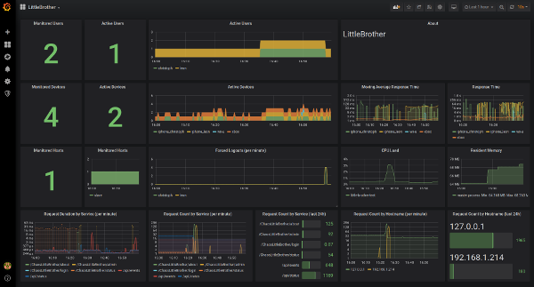

# Operational Monitoring

## Health Check

The application `LittleBrother` has a simple HTTP health check endpoint with relative url `/health` which 
can be monitored by systems such as `icinga`. 
The endpoint will always return HTTP code `200` and the text `OK`. It is automatically active for the master
host since the master host always has its web frontend active anyway. For the slaves the endpoint has to be
activated by setting at least the port the section `[StatusServer]` as in the example below.

    ...
    [StatusServer]
    port=5561
    ...

## Prometheus Interface

`LittleBrother` offers an optional operational monitoring using 
[prometheus_client](https://github.com/prometheus/client_python). The interface is activated by setting
the `port`number in the configuration file:

    ...
    [PrometheusClient]
    port=8888
    ...

The statistics availale from the port can be used by reporting tools such as [Grafana](https://grafana.com/). Note
that you also have to have a server instance of [Prometheus](https://prometheus.io/) running.

## Grafana Configuration File 

`LittleBrother` provides a ready-to-use [Grafana configuration file](etc/grafana-LittleBrother.json). The following
screenshot shows the contents of the Grafana dashboard defined by the configuration.

 
 
