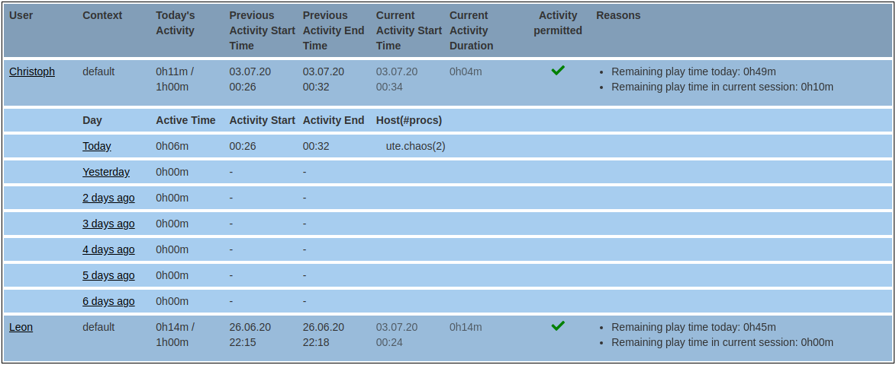
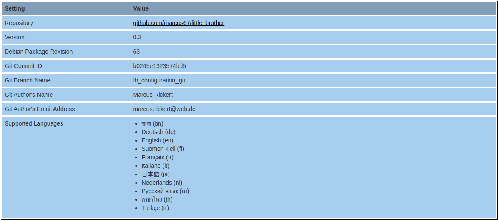

This page is still under construction. Please, bear with me. Thanks!

# Web-Frontend Manual

This page describes the web frontend of `LittleBrother` which usually can be reached at 
[http://localhost:5555](http://localhost:5555) on your local machine. It offers access to status information (without
login() and a configuration interface (with login). 

## Listing the Status

The menu entry "Status" list the play times of all monitored users. The top level shows the summary of the play times
of the current monitored users.

A blinking entry denotes an active login. In case the user is currently allowed to play (see green check mark) the 
column "reasons" shows the estimated remaining play times for the current session (if logged in) and for the day.
If the user is currently blocked (see red cross) the same column shows the reasons why the user is not permitted to 
play and the estimated remaining play time for the day.
   

     
The second level can be opened by clicking on the name of a user. It will show the daily play time, the number 
of logins and the hosts of the the last seven days of the selected user.

The third level can be opened by clicking on a day summary of a user. It will show the individual play times and
hosts of the selected user on the selected day. The entries are sorted by the start time in descending order with
the most recent entry at the top.   

## About Page

The page shows some status information of the installed version of `LittleBrother` and a list of supported languages.

  

## Logging In

## Configuring Users

### Adding Users

### Adding Rulesets

For the time being all configuration regarding rules on who and what to monitor must be done in the configuration file. 
A graphical user interface for administrative may be a central extension of one the future releases. 

A minimum rule set for a single user consists of a single rule defining:

*   the login name of the user,
*   the process pattern that is to be monitored,
*   the minimum time of day (optional),
*   the maximum time of day (optional),
*   the maximum time per day (optional),
*   the maximum duration of one session (optional), and
*   the minimum break time between two sessions.

See example below.

    [RuleSetUser1]
    username=user1
    process_name_pattern=.*sh|systemd
    min_time_of_day=16:00
    max_time_of_day=23:00
    max_time_per_day=1h30m
    max_activity_duration=20m
    min_break=10m

The `username` corresponds to the Linux username. It is expected in all small letters. The process name pattern 
is a regular expression to match the processes of the user. The pattern is implicitly prefixed by `^` and 
suffixed by `$` to exactly match the raw process name in the process table. Command line options 
and/or path information is not taken into consideration.

For most purposes in which general login should be prevented or the current login should be terminated 
a simple `.*sh|systemd` should suffice with `.*sh` taking of all console logins and `systemd` 
taking care of all graphical logins.
 
Timestamps must be given in the format `HH:MM` in military time. Time durations must given in the format `HHh:MMm`. 
Either part may be omitted and the minutes may exceed 60.

Each rule can be seen as a day selector. If all days are to be treated equally one rule should do the job. 

If different days are to be treated differently more rules are required besides the default *catch all* rule. 
To this purpose the setting `context` can be used. If its value is `weekday` the setting
`context_details` will contain either:

*   the concrete name of the day of the week,

*   the string `weekend` comprising Saturday and Sunday, or day-coded seven-character string in which `1`, `X`, or `Y` 
denotes an active day and any other character denotes an inactive day. For example: the string "X-X-X--" would denote 
a rule which is active on Mondays, Wednesdays, and Fridays. 

If the value of `context` is `german-vacation-calendar` the rule is active for all vacation days of a specific 
federal state in Germany. In this case the value of `context_details` denotes the name of the federal state:

*   `Baden-Württemberg`,
*   `Bayern`,
*   `Berlin`,
*   `Brandenburg`,
*   `Bremen`,
*   `Hamburg`,
*   `Hessen`,
*   `Mecklenburg-Vorpommern`,
*   `Niedersachsen`,
*   `Nordrhein-Westfalen`,
*   `Rheinland-Pfalz`,
*   `Saarland`,
*   `Sachsen`,
*   `Sachsen-Anhalt`,
*   `Schleswig-Holstein`, or
*   `Thüringen`.

### Assigning Devices to Users

## Configuring Devices

### Adding Devices

In addition to the processes of the Linux host the application `LittleBrother` can be configured to monitor 
activity on other devices by using the ICMP protocol (`ping`). The assumption is that when a device returns a 
quick response to ping it is currently active (or rather has an active user logged in). If, on the other hand,
the response is slow or if there is no response at all the device is regarded as inactive.

Using a `[ClientDevice*]` section it is possible to configure the scanning of device by giving its DNS name or 
IP address in the field `hostname` as in the example below.

    [ClientDeviceIPhoneUser2]
    name= iphone_user2
    username = user2
    hostname = iphone-user2.my-domain
    sample_size = 10
    min_activity_duration = 60
    max_active_ping_delay = 90

The entry is linked to the `username` on the Linux host. The field `min_activity_duration` denotes how many 
seconds a ping has to be responsive before the host is regarded as active. The field `max_active_ping_delay` 
denotes the maximum response time (measured in milliseconds) a ping may have to still be regarded as 
responsive. The effective delay is computed as moving average over the past `sample_size` response times.

Note that `LittleBrother` is not able terminate any processes on the monitored devices so that the users
may easily exceed their permitted access times there. However, any login times on these devices are added to
the access times on the Linux hosts so that the remaining access time is still influenced. Also, the minimum
break time will apply the point of time when the last other device became inactive.      
  
## Administration

